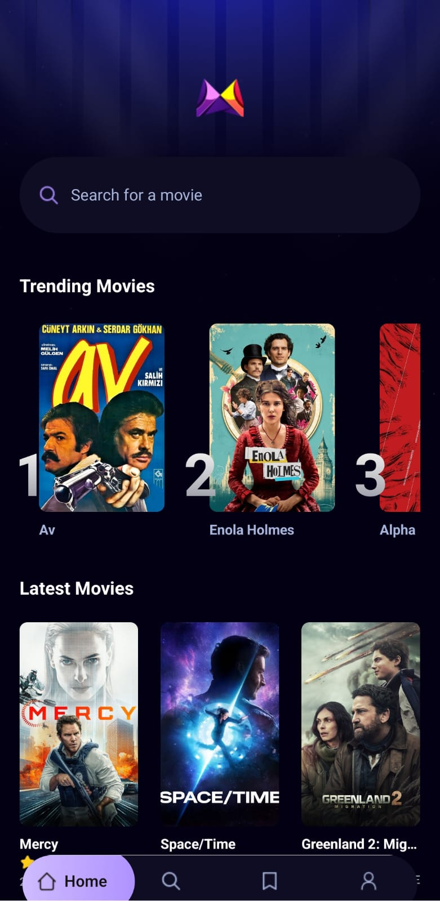
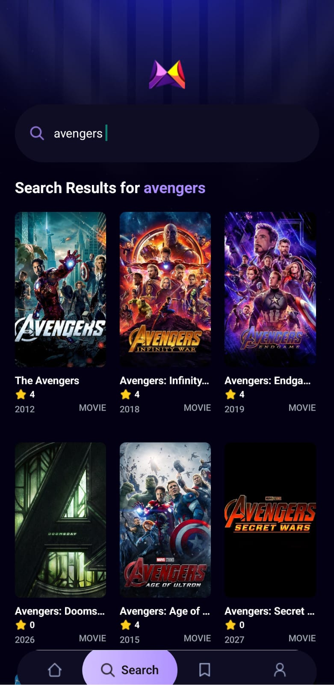

# 🎬 MovieApp

A React Native mobile application for discovering and searching movies, built with Expo, powered by the TMDB API, and featuring trending analytics via Appwrite.

<p align="center">
  
  
  
</p>

## Features

- **Home Screen** — Browse the latest popular movies and view trending titles based on real search data
- **Search** — Debounced movie search powered by the TMDB API, with search analytics tracked in Appwrite
- **Movie Details** — Full detail view including overview, genres, budget, revenue, runtime, and production companies
- **Trending Movies** — Dynamically ranked based on how often users search for a film
- **Tab Navigation** — Home, Search, Saved, and Profile tabs with a custom floating tab bar

## Tech Stack

| Tool                                                     | Purpose                                    |
| -------------------------------------------------------- | ------------------------------------------ |
| [Expo](https://expo.dev) / React Native                  | Mobile framework                           |
| [Expo Router](https://expo.github.io/router)             | File-based navigation                      |
| [TMDB API](https://www.themoviedb.org/documentation/api) | Movie data                                 |
| [Appwrite](https://appwrite.io)                          | Backend — search count tracking & trending |
| [NativeWind](https://www.nativewind.dev)                 | Tailwind CSS for React Native              |

## Project Structure

```
app/
├── (tabs)/
│   ├── _layout.tsx       # Tab bar configuration
│   ├── index.tsx         # Home screen
│   ├── search.tsx        # Search screen
│   ├── saved.tsx         # Saved screen
│   └── profile.tsx       # Profile screen
├── movies/
│   └── [id].tsx          # Movie detail screen
└── _layout.tsx           # Root layout

components/
├── MovieCard.tsx         # Grid movie card
├── TrendingCard.tsx      # Horizontal trending card with rank number
└── SearchBar.tsx         # Reusable search input

services/
├── api.ts                # TMDB API calls
├── appwrite.ts           # Appwrite DB interactions
└── useFetch.ts           # Generic data fetching hook
```

## Getting Started

### Prerequisites

- Node.js 18+
- Expo CLI (`npm install -g expo-cli`)
- A [TMDB API key](https://www.themoviedb.org/settings/api)
- An [Appwrite](https://cloud.appwrite.io) project with a collection set up

### Environment Variables

Create a `.env` file in the project root:

```env
EXPO_PUBLIC_MOVIE_API_KEY=your_tmdb_api_key
EXPO_PUBLIC_APPWRITE_PROJECT_ID=your_appwrite_project_id
EXPO_PUBLIC_APPWRITE_DATABASE_ID=your_appwrite_database_id
EXPO_PUBLIC_APPWRITE_COLLECTION_ID=your_appwrite_collection_id
```

### Appwrite Collection Schema

Create a collection with the following attributes:

| Attribute    | Type    |
| ------------ | ------- |
| `searchTerm` | String  |
| `movie_id`   | Integer |
| `title`      | String  |
| `count`      | Integer |
| `poster_url` | String  |

### Installation

```bash
npm install
npx expo start
```

## How Trending Works

Every time a user searches for a movie and results are returned, the app calls `updateSearchCount` which either creates a new document or increments the `count` for that search term in Appwrite. The `getTrendingMovies` function then retrieves the top 5 most-searched movies to display on the home screen.

## License

MIT
