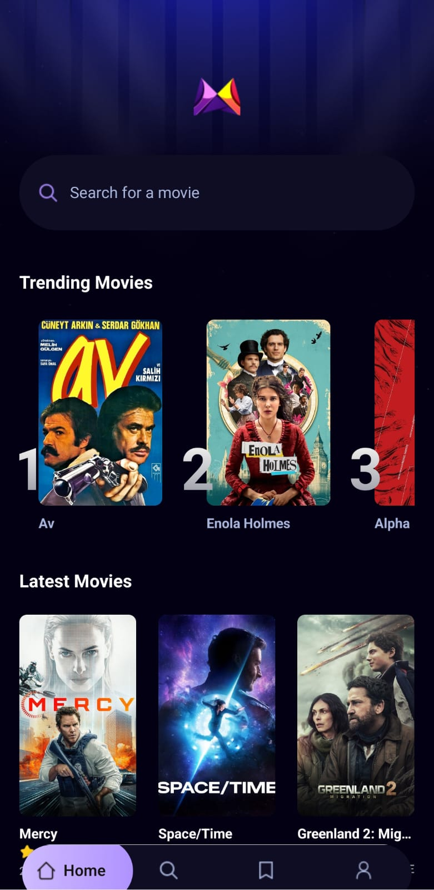
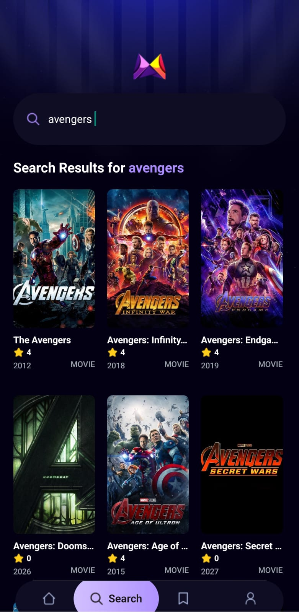

# 🎬 MovieApp

A modern React Native mobile application for discovering, searching, and exploring movies. Built with **Expo** and powered by the **TMDB API**, with **Appwrite** used for search analytics and dynamic trending movies.

<p align="center">
  
  
  
</p>

## 📱 Download

<a href="https://github.com/alaa-okasha/react-native-movies-app/releases/download/v1.0.0/application-f610c829-7242-46c4-8c1d-c3ccb6b70bbc.apk">
  
</a>

> **Android only:** Download and install the APK directly on your Android device.

## ✨ Features

* **Home Screen** — Browse popular movies and discover dynamically trending titles.
* **Search** — Search for movies using a debounced search powered by the TMDB API.
* **Search Analytics** — Search activity is tracked with Appwrite to generate real-time trending results.
* **Movie Details** — View detailed information including overview, genres, budget, revenue, runtime, and production companies.
* **Trending Movies** — Movies are dynamically ranked based on how frequently users search for them.
* **Saved Movies** — Save movies for quick access later.
* **Tab Navigation** — Home, Search, Saved, and Profile tabs with a custom floating tab bar.
* **Responsive UI** — Clean and mobile-friendly interface built specifically for React Native.

## 🛠️ Tech Stack

| Technology                                                | Purpose                                      |
| --------------------------------------------------------- | -------------------------------------------- |
| [Expo](https://expo.dev/) / React Native                  | Mobile application framework                 |
| [Expo Router](https://docs.expo.dev/router/introduction/) | File-based navigation                        |
| [TMDB API](https://developer.themoviedb.org/docs)         | Movie data and search                        |
| [Appwrite](https://appwrite.io/)                          | Backend, search analytics, and trending data |
| [NativeWind](https://www.nativewind.dev/)                 | Tailwind CSS styling for React Native        |

## 📂 Project Structure

```text
app/
├── (tabs)/
│   ├── _layout.tsx       # Tab bar configuration
│   ├── index.tsx         # Home screen
│   ├── search.tsx        # Search screen
│   ├── saved.tsx         # Saved movies screen
│   └── profile.tsx       # Profile screen
├── movies/
│   └── [id].tsx          # Movie detail screen
└── _layout.tsx           # Root layout

components/
├── MovieCard.tsx          # Grid movie card
├── TrendingCard.tsx       # Horizontal trending card
└── SearchBar.tsx          # Reusable search input

services/
├── api.ts                 # TMDB API calls
├── appwrite.ts            # Appwrite database interactions
└── useFetch.ts            # Generic data fetching hook
```

## 🚀 Getting Started

### Prerequisites

Make sure you have the following installed:

* Node.js 18+
* Expo
* A [TMDB API key](https://www.themoviedb.org/settings/api)
* An [Appwrite](https://cloud.appwrite.io/) project with the required database collection

### Installation

Clone the repository:

```bash
git clone https://github.com/alaa-okasha/react-native-movies-app.git
```

Navigate to the project:

```bash
cd react-native-movies-app
```

Install dependencies:

```bash
npm install
```

Start the development server:

```bash
npx expo start
```

## 🔐 Environment Variables

Create a `.env` file in the project root:

```env
EXPO_PUBLIC_MOVIE_API_KEY=your_tmdb_api_key
EXPO_PUBLIC_APPWRITE_PROJECT_ID=your_appwrite_project_id
EXPO_PUBLIC_APPWRITE_DATABASE_ID=your_appwrite_database_id
EXPO_PUBLIC_APPWRITE_COLLECTION_ID=your_appwrite_collection_id
```

> **Note:** Do not commit your `.env` file or API credentials to the repository.

## 🗄️ Appwrite Collection Schema

Create an Appwrite collection with the following attributes:

| Attribute    | Type    |
| ------------ | ------- |
| `searchTerm` | String  |
| `movie_id`   | Integer |
| `title`      | String  |
| `count`      | Integer |
| `poster_url` | String  |

## 📈 How Trending Works

MovieApp uses Appwrite to generate dynamically trending movies based on user search activity.

When a user searches for a movie:

1. The app sends the search request to the TMDB API.
2. When results are returned, the search term is recorded in Appwrite.
3. If the movie already exists, its search `count` is incremented.
4. The app retrieves the most searched movies.
5. The top 5 movies are displayed in the **Trending** section.

This allows the trending section to be based on **actual user search activity** rather than static or predefined data.

## 📸 Screenshots

<p align="center">
  
  
  
</p>

## 👨‍💻 Author

**Alaa Okasha**

Built with ❤️ using React Native, Expo, TMDB API, and Appwrite.

## 📄 License

This project is licensed under the MIT License.
